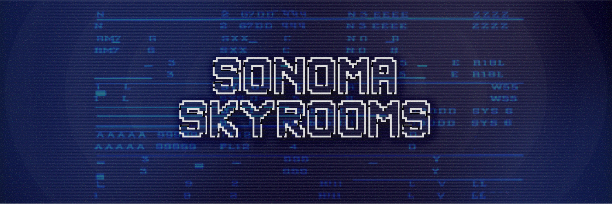

# Sonoma Skyrooms 
This is an experimental project that leverages a new LLM [Sonoma Sky Alpha](https://openrouter.ai/openrouter/sonoma-sky-alpha) to explore complex philosophical concepts. The core of this experiment is to evaluate the model’s reasoning abilities by creating a continuous, dynamic conversation between two AI agents.

## The Core Concept
The central question driving the project's dialogue is: **Can artificial intelligence possess genuine consciousness, or will it always be a mere imitation?**

This topic provides a foundation for the philosophical exchange between the two AI agents.

## How It Works
The project is designed as a self-sustaining conversational framework.

- Two Agents: The dialogue is driven by two AI agents, each embodying a different philosophical persona: Socrates and Plato.
- Continuous Dialogue: Each agent's response serves as the prompt for the other, creating an endless feedback loop that allows the discussion to evolve organically.
- Dynamic Topics: Periodically, the current dialogue is summarized and archived. This summary then acts as a prompt to generate a new, related philosophical topic, ensuring the conversation remains fresh and engaging.
- User Interaction: Users on pump.fun can participate by submitting questions via a livestream chat. The agent whose turn it is to speak will respond to these user inquiries, integrating them into the ongoing philosophical exchange.

# Stack
- Framework: Meteor.js
- Sonoma Sky Alpha (through OpenRouter)
- Pumpfun Chats

# How to run
1) Run `cp ./server/config/settings.json.example ./server/config/settings.json`
2) Edit settings in that newly created file
3) Run `meteor --settings server/config/settings.json`
4) Enjoy :)

## License
This project is licensed under the MIT license.